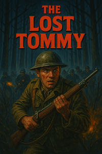

### The story so far
Thick mud clung to his boots as he stumbled through the forest.
Moments ago, his platoon had been ambushed.
Now he was alone, behind enemy lines.
German voices echoed through the fog.
He made it to a clearing, breathing fast.
Shadows moved between the trunks and rifles flashed.
He fired back, his heart pounding with each shot.
He knew that the cavalry would arrive in one minute to save him.
Yet, every tick of his pocket watch felt like a lifetime.
Twenty seconds.
Thirty.
He fought not for glory, but for the hope of seeing home again.
For now, only survival mattered.

### Synopsis
The Lost Tommy is a minimalist twin-stick shooter inspired by World War I.
You are a British solder (a 'Tommy') that must stay alive for one minute to win.
Your many enemies are ruthless and have even deployed barbed wire.
To stand a chance, you must rely on your trusty rifle, your swiftness, but most of all, your wits.

### How to play
* Download [latest release](https://github.com/joerivandervelde/the-lost-tommy/releases) for your operating system
* Extract contents and run `tommy`

### Game controls
 * Movement (in 8 directions): `W` `A` `S` `D`
 * Fire (in 8 directions): `I` `J` `K` `L`
 * Pause/restart: `SPACEBAR`
 * Quit: `ESC`

### The battlefield
 * Trees are plentiful and provide cover, but are destroyed by bullets
 * Rocks are few, but provide permanent cover from bullets
 * Barbed wire kills you, but also your enemies, on contact

### Your enemies
 * Your foes will chase you and fire at you
 * In melee range, their bayonets are lethal

### Mission objective
 * Survive for one minute to win

### How to compile
 * [Windows 64-bit](doc/compile_win.md)
 * [Linux 64-bit](doc/compile_linux.md)
 * [Apple silicon](doc/compile_apple.md)

### Note
 * The development of this game has benefitted from the use of generative artificial intelligence.
